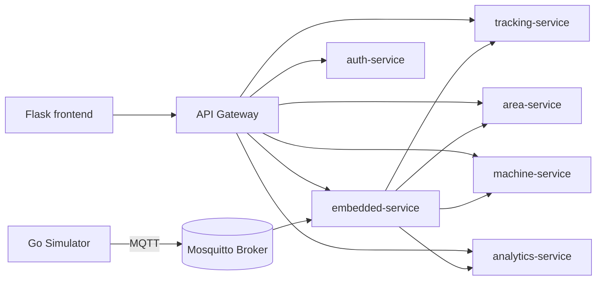

# 4. Implementation

This chapter describes how the SmartGym Monitor design was translated into code.
The implementation follows the bounded contexts and the microservice decomposition introduced in the previous chapters.

## 4.1 Overall Structure

The project is organized as a monorepo with three main layers:

- **Backend microservices** implemented in Java 21 with Spring Boot 3.4.3;
- **Frontend web application** implemented in Python 3.12 with Flask;
- **Simulator** implemented in Go, used to generate MQTT messages that emulate smart gym devices.

The backend is organized around independent services registered on Eureka and exposed through an API Gateway.
Operational data is persisted in MongoDB, while the embedded layer converts device-level events into structured requests handled by the backend services.

<em>Listing 4.1: High-level architecture flow represented in Mermaid</em>

## 4.2 Backend Microservices

### 4.2.1 `service-discovery`

The discovery service hosts Eureka on port `8761`.
It acts as the central registry used by the other services to register themselves and discover one another.

### 4.2.2 `gateway`

The gateway runs on port `8080` and exposes the main entry point for backend requests.
It routes traffic to the microservices using service discovery and also performs JWT-related checks for protected paths.

The configured routes expose the services under these prefixes:

- `/auth-service/**`
- `/analytics-service/**`
- `/embedded-service/**`
- `/machine-service/**`
- `/area-service/**`
- `/tracking-service/**`

### 4.2.3 `auth-service`

The authentication service manages administrator login, registration, user lookup, and logout.
It stores data in MongoDB and issues JWT access tokens.

Main endpoints:

- `POST /login`
- `POST /register`
- `GET /login/{username}`
- `POST /logout`

### 4.2.4 `tracking-service`

This service manages gym sessions.
It creates and closes sessions when a member enters or exits the gym and exposes the current gym count.

Main endpoints:

- `POST /start-session`
- `POST /end-session`
- `GET /count`
- `GET /active-sessions`

### 4.2.5 `area-service`

The area service manages gym areas and area-level occupancy.
It processes access events, exit events, area queries, and capacity updates.

Main endpoints:

- `POST /access`
- `POST /exit`
- `GET /{areaId}`
- `GET /`
- `PUT /capacity`

### 4.2.6 `machine-service`

The machine service manages machines, their status, and machine sessions.
It supports machine creation, update, maintenance, session start/end, and historical queries.

Main endpoints:

- `POST /machines`
- `PUT /machines/{machineId}`
- `POST /start-session`
- `POST /end-session`
- `POST /set-maintenance`
- `GET /{machineId}`
- `GET /history/{machineId}`

### 4.2.7 `analytics-service`

The analytics service stores and exposes historical data used by the dashboard.
It ingests events and computes attendance, area attendance, machine utilization, and peak hours.

Main endpoints:

- `POST /events/ingest`
- `GET /attendance/{date}`
- `GET /attendance`
- `GET /machine-utilization`
- `GET /machine-utilization/{date}`
- `GET /peak-hours`
- `GET /peak-hours/{date}`
- `GET /area-attendance`
- `GET /area-attendance/{date}`
- `GET /area-attendance/{date}/{areaId}`
- `GET /area-peak-hours`
- `GET /area-peak-hours/{date}`
- `GET /area-peak-hours/{date}/{areaId}`

### 4.2.8 `embedded-service`

The embedded service is the integration layer between physical devices and backend services.
It subscribes to MQTT topics, forwards events to the operational services, and translates low-level messages into higher-level domain commands.

The service uses adapters for the area, tracking, machine, and analytics services, plus an MQTT manager to publish and receive messages.

## 4.3 Frontend Web Application

The frontend is a Flask application located in `src/frontend/smartgym_flask`.
It provides a lightweight dashboard for authentication and for checking the reachability of the backend services.

The application includes:

- a login page that authenticates against `auth-service`;
- a dashboard page that verifies the logged user via `/login/{username}`;
- a health endpoint at `/api/health` used by automated checks.

The frontend stores the access token in the user session and forwards it when interacting with the authentication service.
It does not implement the business logic of the gym: that remains in the backend microservices.

## 4.4 Simulator and Event Generation

The simulator is a Go application that publishes MQTT messages to emulate gym activity.
It generates access events for turnstiles, area readers, and machine sensors.

The simulator uses a fixed set of hardcoded areas, machines, and devices, then periodically decides whether a gym member enters the gym, moves between areas, starts a machine session, or leaves.
This approach allows the platform to be exercised end-to-end without requiring real hardware.

The simulator publishes messages such as:

- gym access events,
- area access events,
- machine usage events,
- device status messages.

## 4.5 Persistence and Data Flow

Each operational service owns its own MongoDB database.
This keeps the services loosely coupled and makes it possible to scale or evolve each bounded context independently.

The typical flow is:

1. the simulator emits MQTT events;
2. the embedded service receives and normalizes them;
3. the tracking, area, and machine services update their domain state;
4. analytics stores historical snapshots and aggregated metrics;
5. the frontend dashboard queries the authentication service and exposes the system entry point for administrators.

## 4.6 Validation Strategy

The implementation is validated through multiple test layers:

- **unit tests** for service and domain logic;
- **integration tests** for controller and persistence behavior;
- **e2e tests** for the full system flow.

This structure matches the repository test organization and supports continuous verification during development.
