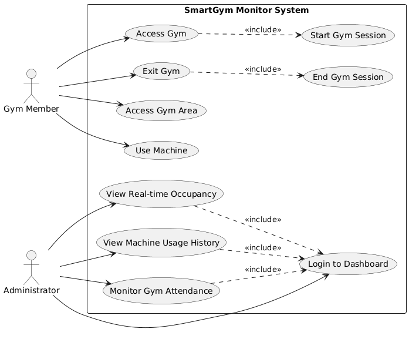
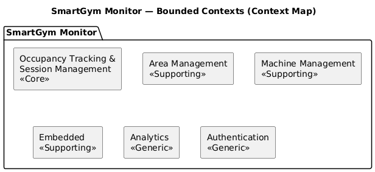

# 2. Requirements Analysis

> This section describes the domain and system requirements following a Domain-Driven Design approach.

## 2.1 Domain Definition

<!--
- Describe the problem domain
- Define the main goal of the system
- Identify the main actors involved
- Clarify what is inside and outside the domain boundary
-->

The Core Domain of the SmartGym Monitor system is Occupancy Tracking and Session Management.
It is responsible for maintaining consistent and real-time information about gym areas and machines, ensuring correct state transitions, enforcing capacity constraints, and managing usage sessions.
This domain contains the main business logic and represents the highest business value of the system.

The aim of the system is therefore to manage the gym comprehensively, with particular attention to the management of machine occupancy.
The system must be able to monitor the use of machines by users, providing real-time information on availability and occupancy.

We decide to split the domain in more subdomains as shown in the following section, in order to break down the complexity of the system.

## 2.2 Subdomains Definitions

- **Core — Occupancy Tracking & Session Management**: this subdomain represents the main business value of the system. It manages gym area occupancy, machine state transitions (Free / Occupied / Maintenance), and the lifecycle of gym and machine sessions. It enforces domain invariants such as capacity constraints and consistency between machine state and active sessions.

- **Supporting — Embedded**: this subdomain includes the interaction with physical devices. In particular, it manages machine sensors, RFID readers, turnstiles, and real-time communication with the backend.

- **Supporting — Area Management**: this subdomain manages all aspects related to gym areas. It handles area configuration, capacity definition, and tracking of entry and exit events.

- **Supporting — Machine Management**: this subdomain manages all aspects related to gym machines. It handles machine configuration, status updates, and integration with session tracking.

- **Generic — Analytics**: this subdomain provides data collection and processing functionalities. It offers machine occupancy rate, average dwell time, and attendance statistics to support administrative decision-making.

- **Generic — Authentication**: this subdomain manages identity verification and access control. It provides mechanisms for administrator login and microservice authentication.

## 2.3 Ubiquitous Language / Glossary

> This section defines the shared domain language used throughout the project.
> All terms listed in the table below must be used consistently in documentation,
> diagrams, and source code.

| Term                       | Description                                                                                                                 | Notes / Context            |
| -------------------------- | --------------------------------------------------------------------------------------------------------------------------- | -------------------------- |
| Gym                        | The physical facility composed of multiple areas.                                                                           | Core Domain                |
| Gym Area                   | A specific physical zone inside the gym (e.g., cardio zone, free weights area, machines area).                              | Area Management            |
| Cardio Area                | A specific physical zone inside the gym (e.g., cardio zone, free weights area, machines area).                              | Area Management            |
| Weight Area                | A specific physical zone inside the gym (e.g., cardio zone, free weights area, machines area).                              | Area Management            |
| Class Area                 | A specific physical zone inside the gym (e.g., cardio zone, free weights area, machines area).                              | Area Management            |
| Entrance Area              | The entrance zone of the gym, where access is controlled by the turnstile.                                                  | Embedded / Tracking        |
| Machine Area               | A specific physical zone inside the gym dedicated to machines.                                                              | Area Management            |
| Area count                 | The number of people currently present in a gym area, including both people who are using machines and people waiting.      | Area Management            |
| Gym count                  | The number of people currently present in the gym.                                                                          | Tracking Service           |
| Turnstile                  | An element that allows access to the gym/a gym area if a badge is read correctly, is positioned at the entrance of the gym. | Embedded                   |
| RFID reader                | A reader detecting user entry and exit, by using RFID.                                                                      | Embedded                   |
| Door                       | An opening that allows passage from one area of the gym to another.                                                         | Embedded                   |
| Access Area Direction      | The value that describes the direction of access between areas. It can be _IN_ or _OUT_.                                    | Embedded / Area Management |
| Machine                    | A gym equipment unit that can be used by a user.                                                                            | Machine Management         |
| Proximity sensor           | A sensor that detects whether the machine is being used by a user.                                                          | Machine Management         |
| Occupancy                  | The current status of a machine, which can be _Free_, _Occupied_, or _Maintenance_.                                         | Machine Management         |
| Gym Attendance             | Historic attendance of people at the gym.                                                                                   | Analytics Service          |
| Gym Member                 | A gym member accessing gym areas.                                                                                           | Area Management            |
| Enter Area Event           | Event indicating that a gym member entered a gym area.                                                                      | Embedded / Area Management |
| Exit Area Event            | Event indicating that a gym member left a gym area.                                                                         | Embedded / Area Management |
| Enter Gym Event            | Event indicating that a gym member entered the gym through the entrance turnstile.                                          | Embedded / Tracking        |
| Exit Gym Event             | Event indicating that a gym member left the gym through the exit turnstile.                                                 | Embedded / Tracking        |
| Gym Member Machine Session | The time interval during which a gym member uses a machine.                                                                 | Machine Management         |
| Gym Member Session         | The time interval during which a gym member stays in the gym.                                                               | tracking-service           |
| Admin or Administrator     | Staff member responsible for monitoring gym usage and congestion.                                                           | Analytics / Authentication |

_Table 1: Glossary of SmartGym Domain_

## 2.4 System Requirements

This section lists all system requirements, divided into functional and non-functional requirements.

### 2.4.1 Functional Requirements

<!--
- Define what the system must do
- Number each requirement
- Make requirements clear and testable
-->

1. The system must allow users to access the gym via a turnstile at the entrance of the gym, which reads their badge and grants or denies access accordingly
2. The system must allow users to access different areas of the gym via RFID badge readers
3. The door must allow users to enter a gym area
4. The system must allow users to use machines if they are free
5. The system must detect when a machine is occupied or free
6. The system must allow administrators to view the occupancy status of machines in real time and the machine usage history
7. The system must correctly manage user and machine access data, ensuring data consistency and integrity

### 2.4.2 Non-Functional Requirements

<!--
- Define quality attributes (performance, scalability, reliability, etc.)
- Include architectural and design constraints
- Relate requirements to project goals
-->

1. The system must guarantee the security of user and machine data
2. The system must have low latency to provide real-time information
3. The system must be scalable to handle a growing number of users and machines
4. The system must be able to read a configuration file at startup to initialize the system with the correct settings
5. The system must be reliable and available to guarantee continuous service to users and administrators

## 2.5 Use Case

In this section is shown the use case diagram of the system from the point of
view of the two main actors: Administrator and Gym Member.

In the following tables the description of each use case related to Administrator and Gym Member.

| Use Case                   | Description                                                                                                        |
| -------------------------- | ------------------------------------------------------------------------------------------------------------------ |
| Login to Dashboard         | Allows the administrator to access the monitoring dashboard. Required before performing any administrative action. |
| View Real-time Occupancy   | Displays the current occupancy status of gym areas and machines in real time.                                      |
| View Machine Usage History | Allows the administrator to consult historical data about machine usage sessions.                                  |
| Monitor Gym Attendance     | Shows aggregated data about gym attendance, including peak hours and occupancy trends.                             |

_Table 2: Administrator Use Case Description_

| Use Case        | Description                                                                                                                         |
| --------------- | ----------------------------------------------------------------------------------------------------------------------------------- |
| Access Gym      | Allows the gym member to enter the gym through the turnstile using their badge. This action automatically starts a new Gym Session. |
| Exit Gym        | Allows the gym member to leave the gym. This action automatically ends the current Gym Session.                                     |
| Access Gym Area | Allows the gym member to enter a specific gym area using badge authentication.                                                      |
| Use Machine     | Allows the gym member to use a machine if it is available. The system detects and records the machine session automatically.        |

_Table 3: Gym Member Use Case Description_

## 2.6 User Stories

> In order to better understand the domain following Domain Driven Design we
> isolate user stories in order to better achieve acceptance criteria.

| ID    | User Story                                                                                                                  | Related FR |
| ----- | --------------------------------------------------------------------------------------------------------------------------- | ---------- |
| US-01 | As a **Gym Member**, I want to enter the gym with my badge, so that my presence is tracked automatically.                   | FR-1       |
| US-02 | As a **Gym Member**, I want to access a gym area with RFID validation, so that area occupancy is updated in real time.      | FR-2, FR-3 |
| US-03 | As a **Gym Member**, I want machine usage to be detected automatically, so that sessions are recorded without manual input. | FR-4, FR-5 |
| US-04 | As an **Administrator**, I want to monitor machine occupancy and history, so that I can analyze usage trends.               | FR-6       |

## 2.7 Quality Attributes Scenarios

| Quality Attribute  | Stimulus                                               | Environment                                              | Artifact                                                        | Response                                                                            | Response Measure                                                        |
| ------------------ | ------------------------------------------------------ | -------------------------------------------------------- | --------------------------------------------------------------- | ----------------------------------------------------------------------------------- | ----------------------------------------------------------------------- |
| **Performance**    | A gym member enters an area or starts using a machine. | Normal operating conditions with multiple users present. | Area Management and Machine Management services.                | The system updates occupancy status and propagates the change to the dashboard.     | Updated data visible within **2 seconds**.                              |
| **Scalability**    | Increase in number of users and machines.              | Peak hours with high concurrent usage.                   | Backend microservices and database.                             | The system handles increased load without degradation.                              | Response time ≤ **3 seconds** under peak load; no data loss.            |
| **Availability**   | A non-critical service failure occurs.                 | Production environment during operational hours.         | Embedded or Analytics service.                                  | The system continues operating and restores the failed component or notifies admin. | At least **99% uptime** during operational hours.                       |
| **Reliability**    | A badge is scanned at the turnstile.                   | Normal network conditions.                               | Authentication and Area Management services.                    | The system validates the badge and records the access event correctly.              | No duplicated or missing events; guaranteed event persistence.          |
| **Security**       | An administrator attempts to access the dashboard.     | Internal or external network access.                     | Authentication service and API Gateway.                         | The system requires valid credentials and enforces authorization.                   | Unauthorized access denied and logged; communication encrypted (HTTPS). |
| **Modifiability**  | A new gym area or machine is added.                    | Maintenance phase.                                       | Configuration files and the `area-service` / `machine-service`. | The system allows configuration without changing core logic.                        | New elements configurable without code modification.                    |
| **Data Integrity** | Concurrent machine occupancy events occur.             | High concurrent usage.                                   | Machine Management aggregate and database.                      | The system maintains consistent machine state transitions.                          | A machine cannot be both _Free_ and _Occupied_ simultaneously.          |

## 2.8 Story Telling

> In this section, realistic usage scenarios are described in order to better understand how the SmartGym Monitor system behaves
> in real-life situations. Storytelling is used as a complementary technique to formal models and diagrams, allowing us to
> observe how domain concepts interact dynamically over time.   The objective of this section is to highlight how the system reacts to physical events (such as badge scans or machine usage detection),
> how sessions are created and terminated, and how data becomes available for monitoring and analytics.

### 2.8.1 Gym member Storytelling

<!--
- Describe system behavior from a gym member perspective
- Focus on interactions with sensors and physical space
-->

Users access the gym through the entrance turnstile, which reads their badge.
From the moment the user enters the gym, a gym session is tracked, which begins with entry and ends with exit from the gym.
Each time a user badge is scanned, it is logged, including the timestamp and, in the case of door access, the direction of travel.
Once inside the gym, users can go to the changing Area to get ready.
Every door in the facility, including the changing Area door, is equipped with an RFID reader that reads the user's badge to identify the Area they are entering.
Inside the equipment area, users can use the machines. Each machine tracks its use by a user, so it can detect whether a person is using it and for how long, in practice, it tracks user sessions.
There are also cardio and weight areas and an area for classes, where the machines detect their use by users in the same way as in the equipment area.
When the user has finished their workout, they return to the changing Area to get changed, passing through the doors and finally exiting the gym through the turnstile.

### 2.8.2 Administrator Storytelling

<!--
- Describe system behavior from an administrator perspective
- Focus on monitoring and decision-making activities
-->

The administrator logs into an Admin console via a web interface.
After authentication, they are shown a Dashboard displaying the current status of the gym, including the occupancy of each Area, individual machines, and even the operations available to the admin.
The admin can consult the occupancy history of the machines and gym attendance, in order to understand which days and times are of greatest interest to users.
The administrator can then view User Gym Sessions and User Machine Sessions in a convenient and understandable way, using appropriate graphs.

## 2.9 Domain Model

> Analyzing the requirements we started to create the domain model considering the main entities, value objects and aggregates in our
> core domain. In following section the are the main entities of the core domain.

### 2.9.1 Entities and Value Objects

| Entity Name     | Identity         | Main Attributes                        | Responsibilities / Behavior                             | Bounded Context    |
| --------------- | ---------------- | -------------------------------------- | ------------------------------------------------------- | ------------------ |
| Gym Area        | AreaId           | name, capacity, currentCount           | Update area count, enforce capacity constraint          | Area Management    |
| Machine         | MachineId        | status, areaId                         | Change occupancy state, enforce valid state transitions | Machine Management |
| Gym Session     | GymSessionId     | badgeId, startTime, endTime            | Track presence inside the gym                           | tracking-service   |
| Machine Session | MachineSessionId | machineId, badgeId, startTime, endTime | Track machine usage duration                            | Machine Management |

_Table X: Core Domain Entities_

| Value Object        | Attributes                    | Role |
| ------------------- | ----------------------------- | ---- |
| **OccupancyStatus** | Free / Occupied / Maintenance |      |
| **TimeInterval**    | startTime, endTime            |      |
| **Capacity**        | maxPeople                     |      |
| **GymCount**        | currentCount                  |      |
| **AreaCount**       | currentCount                  |      |
| **BadgeId**         | string/uuid                   |      |

_Table X: Core Domain Value Objects_

### 2.9.2 Aggregates

| Aggregate Root     | Governs                                             | Invariants (examples)                                                                                                                                                  |
| ------------------ | --------------------------------------------------- | ---------------------------------------------------------------------------------------------------------------------------------------------------------------------- |
| **Machine**        | Machine state and consistency with machine sessions | A machine cannot be _Occupied_ without an active _MachineSession_; only valid state transitions are allowed (Free ↔ Occupied; Maintenance according to defined rules). |
| **GymArea**        | Area occupancy count and capacity enforcement       | `0 ≤ currentCount ≤ capacity` must always hold.                                                                                                                        |
| **GymSession**     | Member presence inside the gym                      | A badge cannot have more than one active _GymSession_ at the same time; a session must have a start time and can only end through a valid exit event.                  |
| **MachineSession** | Member usage of a machine                           | A machine cannot have more than one active session simultaneously; every _MachineSession_ must be associated with exactly one _Machine_.                               |

_Table X: Core Domain Aggregates_

### 2.9.3 Domain Events

| Event                       | Trigger Condition                        | Effect in the Domain                                                                 |
| --------------------------- | ---------------------------------------- | ------------------------------------------------------------------------------------ |
| **GymSessionStarted**       | A badge is scanned at the gym entrance   | Creates a new _GymSession_ and marks the member as present in the gym.               |
| **GymSessionEnded**         | A badge is scanned at the gym exit       | Closes the active _GymSession_ for the corresponding badge.                          |
| **AreaEntered**             | A member enters a specific gym area      | Increments the `currentCount` of the corresponding _GymArea_.                        |
| **AreaExited**              | A member leaves a specific gym area      | Decrements the `currentCount` of the corresponding _GymArea_.                        |
| **MachineSessionStarted**   | A machine transitions to _Occupied_      | Creates a new _MachineSession_ and sets the machine status to _Occupied_.            |
| **MachineSessionEnded**     | A machine transitions to _Free_          | Closes the active _MachineSession_ and sets the machine status to _Free_.            |
| **MachineSetToMaintenance** | An administrator sets the machine status | Updates the machine status to _Maintenance_ and prevents new sessions from starting. |

_Table X: Core Domain Events_

## 2.10 Bounded Context

> Each bounded context defines its own **model, terminology, and invariants**, reducing coupling and enabling independent evolution of system components.

The SmartGym Monitor system is structured into **Core**, **Supporting**, and **Generic** bounded contexts as described below.

- **Occupancy Tracking & Session Management (Core)**:  
  This bounded context represents the central business logic of the system. It is responsible for tracking gym and machine sessions, maintaining real-time occupancy consistency, enforcing capacity constraints, and validating machine state transitions (_Free / Occupied / Maintenance_). It contains the highest business value and governs the main domain invariants.
- **Area Management (Supporting)**: This context manages gym areas and spatial configuration. It is responsible for area definitions, capacity limits, entry and exit event handling, and maintaining the number of people currently present in each area.
- **Machine Management (Supporting)**: This context focuses on gym machines and their lifecycle. It handles machine configuration, status updates, association with sessions, and synchronization with occupancy tracking.
- **Embedded (Supporting)**: This bounded context includes all interactions with physical or simulated devices. It manages RFID readers, turnstiles, door sensors, and proximity sensors, producing low-level events that are later translated into domain events.
- **Analytics (Generic)**: This context collects and processes historical data related to gym attendance, machine usage, and occupancy trends. It provides aggregated statistics and visual insights to support administrative decision-making and long-term planning.
- **Authentication (Generic)**: This bounded context manages identity verification and access control mechanisms. It handles administrator login, credential validation, and service-to-service authentication in the microservice architecture.

## 2.11 Context Map

The context map reflects a **hub-and-spoke** style integration centered on occupancy and session management.

- **Embedded → area-service / tracking-service / machine-service**: the embedded context acts as an event producer. It captures RFID scans, turnstile actions, and proximity changes, then forwards them to the backend via MQTT and HTTP adapters.
- **area-service ↔ tracking-service**: the area context consumes gym access information and contributes to occupancy consistency. It depends on the tracking service for the lifecycle of gym sessions.
- **machine-service ↔ tracking-service**: the machine context relies on session information to associate machine usage with a gym member and keep machine state synchronized with active sessions.
- **analytics-service ← area-service / tracking-service / machine-service**: the analytics context is a read-oriented consumer. It aggregates historical data generated by operational services and exposes monitoring views for administrators.
- **auth-service → gateway / dashboard**: the authentication context protects the administrative access path and issues JWT tokens consumed by the gateway and the Flask frontend.

The main integration patterns are:

- **Customer–Supplier** between embedded devices and operational services, because device events feed the core domain.
- **Open Host Service** for shared access through REST endpoints and the API Gateway.
- **Anti-Corruption Layer** in the embedded service, which translates low-level device messages into structured backend commands.

This structure allows each bounded context to evolve independently while preserving a consistent system-wide model.
